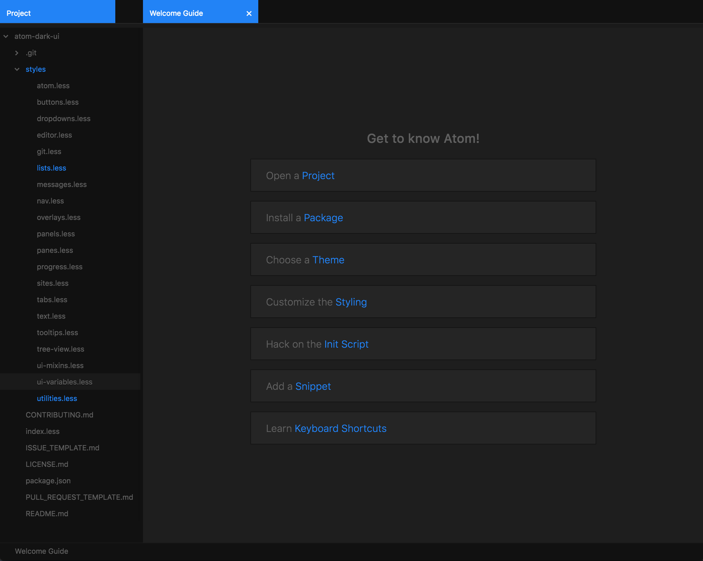

# Trappist-1 UI theme

A dark UI theme for Atom inspired by Trappist-1.

This theme can be activated by going to
the _Themes_ section in the Settings view (`cmd-,`) and selecting it from the
_UI Themes_ drop-down menu.

